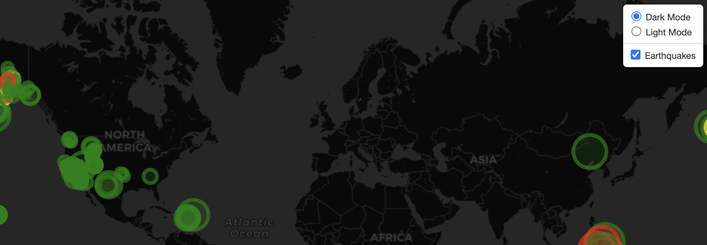
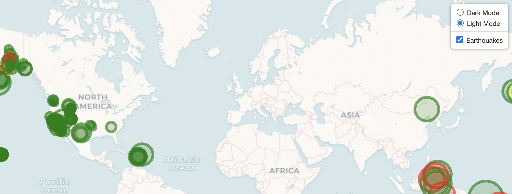

# Leaflet Challenge

For this challenge we are tasked to plot earthquake occurrences based on the data from the Unites States Geological Survey (USGS). The plots will be using the longitude and latitude of the data to plot the location and the markers will reflect the magnitude of the earthquake by their size and the depth of the earthquake by color. 

Unfortunately, due to loading issues I was unable to use mapbox’s features so instead I decided to use OpenStreetMap and created a dark mode and light mode toggle.

### Dark Mode

### Light Mode

